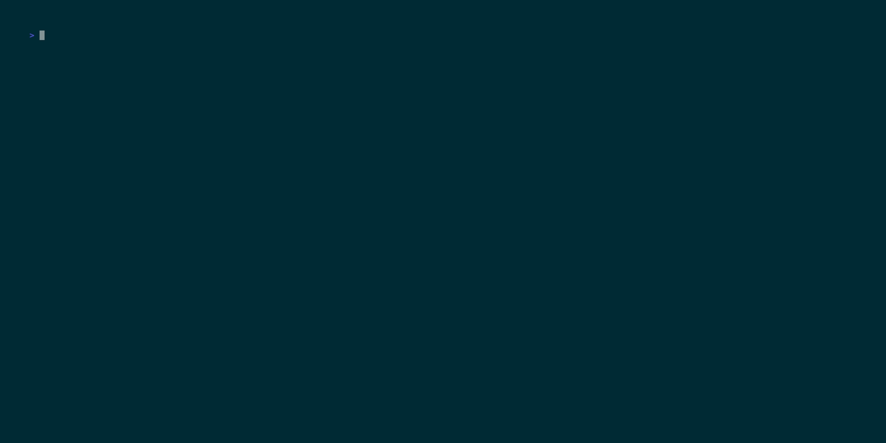

# TBAM Viewer

Simple terminal BAM viewer built with Textual + pysam.

## What It Does

- Shows BAM reads in a table.
- Shows a reference-centered pileup panel:
  - reads stacked above
  - coordinate + reference track at the bottom
- Supports pan/zoom in the pileup window.
- Highlights bases with background colors.

## Install

```bash
python3 -m venv .venv
source .venv/bin/activate
python -m pip install -U pip
python -m pip install -e .
```

## Quick Demo

```bash
python -m tbam.cli demo-data --out-dir sample_data --reads 400
python -m tbam.cli view sample_data/demo.bam --reference sample_data/demo.fa
```

## Interface GIF



## Use With Your BAM

1. Index BAM:
```bash
samtools index /path/to/your.bam
```

2. (Recommended) Index reference FASTA:
```bash
samtools faidx /path/to/ref.fa
```

3. Open viewer:
```bash
python -m tbam.cli view /path/to/your.bam --reference /path/to/ref.fa
```

## Viewer Controls

- `q`: quit
- `h`: toggle BAM header
- `r`: reload
- `a` / `d`: pan left / right
- `[` / `]`: zoom in / out
- `0`: center pileup on selected read row

## Useful Flags

```bash
python -m tbam.cli view /path/to/your.bam \
  --reference /path/to/ref.fa \
  --window-bp 80 \
  --panel-reads 120 \
  --min-mapq 20
```

## Commands

- `python -m tbam.cli view <bam>`
- `python -m tbam.cli inspect <bam>`
- `python -m tbam.cli panel-preview <bam>`
- `python -m tbam.cli demo-data`

## Color Scheme

- Colorblind-friendly base palette (white text on colored backgrounds)
- `A`: deep blue background
- `C`: dark amber background
- `G`: teal background
- `T`: purple-magenta background
- mismatch: gray background
- gap/skip/insertion marker (`-`, `~`, `+`): dark red background
- text: white
